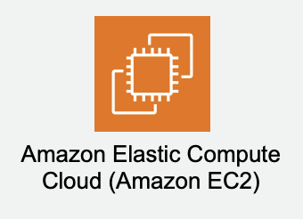

# AWS Examples

Many AWS users over-architect their stacks. Sometimes this is because they expect a huge volume of new customers or they are using architecture that is more

Iam a firm believer that infrastructure needs to be simple, secure and as cheap as possible. So, the steps

### Make it tidy
1. EC2 instances are disposable (no assets, all software is built on the fly)
2. All infrastructure is built using CloudFormation

### Store everything where it belongs

1. Assets belong in S3
2. Data belongs in a dedicated database, RDS preferably
3. Sessions belong in Elasticache
4. Infrastructure belongs in code (CloudFormation)
5. Config files belong on a shared storage device

The minimum stack comprises of these:
. 
